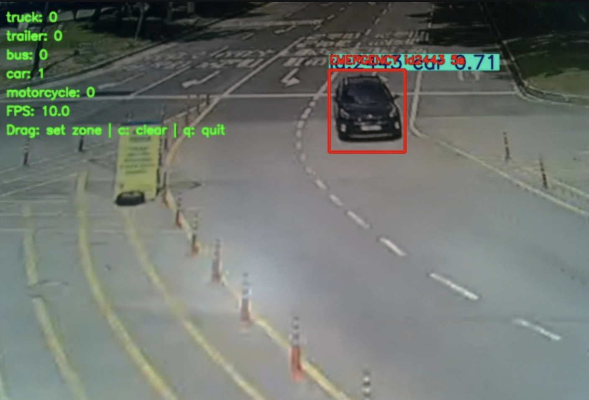
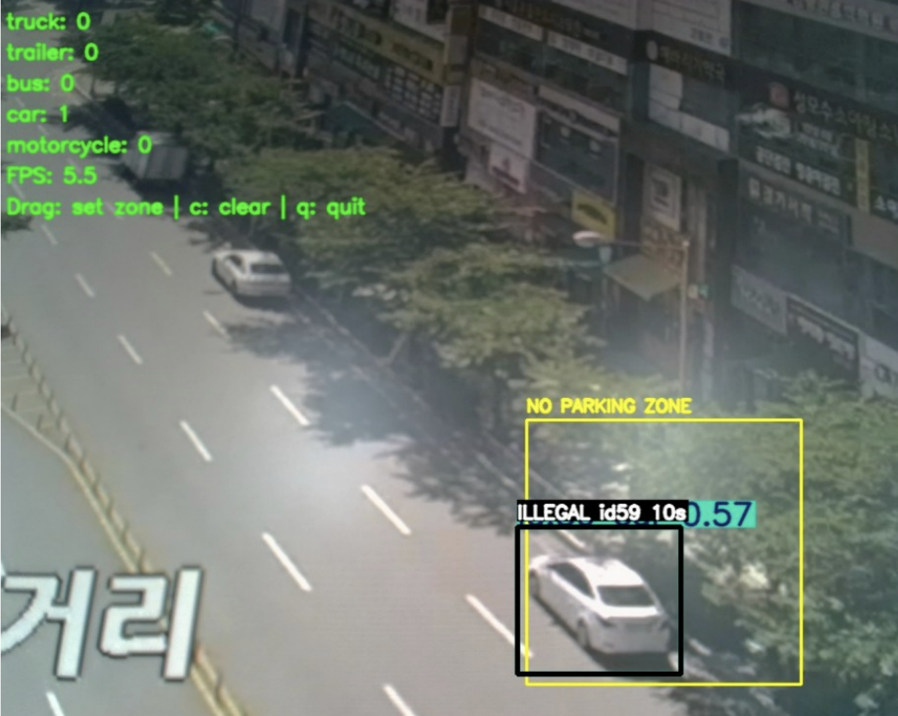
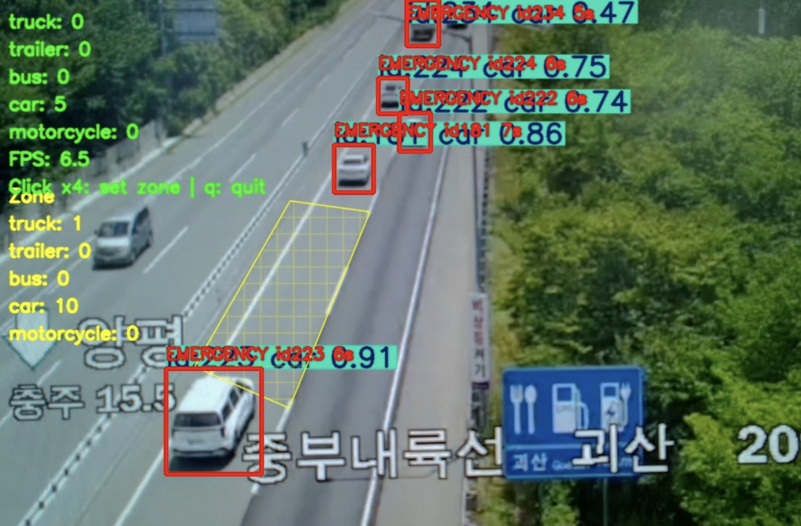
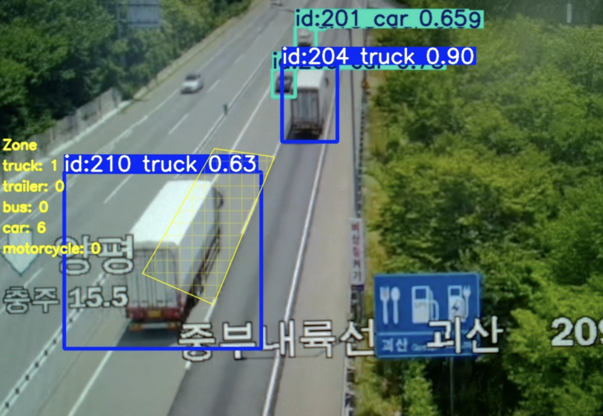

# 🚗 YOLO 기반 차량 인식·분류 및 도로 상황 감지 시스템

> YOLO 기반 객체 검출과 추적 기술을 활용하여 국도와 고속도로 환경의 차량을 실시간으로 인식하고, 정차 차량·불법 주정차·제한 차로 주행 트럭 등의 도로 상황을 판단하는 시스템입니다.

<br>

## 📌 프로젝트 개요

도로 CCTV 또는 카메라 영상을 입력받아 차량을 실시간으로 검출·분류하고, 국도와 고속도로 환경에 서로 다른 판단 조건을 적용하여 위험 상황을 감지하는 시스템을 구현했습니다.

국도 환경에서는 정차 차량과 불법 주정차 차량을 판단하고, 고속도로 환경에서는 정차 차량과 제한 차로를 주행하는 트럭을 감지하도록 구성했습니다.

YOLO11n 모델을 ONNX 형식으로 변환한 뒤 TensorRT Engine으로 최적화하여 NVIDIA Jetson 환경에서 실시간 추론을 수행했습니다.

<br>

## 📅 수행 기간

**2026.06.22 ~ 2026.06.30**

<br>

## 👥 프로젝트 형태

**4인 팀 프로젝트**

<br>

## 🙋 담당 역할

- 국도용 차량 감지 알고리즘 구현
- 국도 환경의 정차 차량 판단 조건 설계
- No Parking Zone 기반 불법 주정차 판단 로직 구현
- 차량 중심 좌표를 이용한 Zone 진입 여부 판단
- Confidence Hold Filter 적용
- Cross-Class Duplicate Filter 적용
- 국도 시연 영상 수집 및 결과 분석

> 전체 시스템은 팀 프로젝트로 진행했으며, 본인은 국도 환경의 정차 차량 및 불법 주정차 판단 로직과 후처리 필터 구현을 담당했습니다.

<br>

## 🛠 사용 기술

### 프로그래밍

- Python
- OpenCV
- NumPy

### 인공지능 및 컴퓨터 비전

- YOLO11n
- Ultralytics
- ByteTrack
- IoU
- Bounding Box
- Object Detection
- Object Tracking

### 모델 최적화 및 배포

- ONNX
- TensorRT
- NVIDIA Jetson
- CUDA

<br>

## 🏗 시스템 구성

카메라 또는 도로 영상을 입력받아 YOLO 모델로 차량을 검출하고, ByteTrack을 이용해 차량별 Tracking ID를 유지하며 실시간으로 추적합니다.

검출 결과에는 Confidence Hold Filter, IoU 기반 객체 매칭, Cross-Class Duplicate Filter 등의 후처리를 적용합니다.

이후 도로 환경별 판단 조건을 이용하여 정차 차량, 불법 주정차 차량 및 제한 차로 주행 트럭을 감지하고 해당 장면을 이미지로 저장합니다.

```text
카메라 및 CCTV 입력
        ↓
YOLO11n 차량 검출
        ↓
ByteTrack 객체 추적
        ↓
Confidence / IoU / Duplicate Filter
        ↓
도로 환경별 상황 판단
        ↓
Bounding Box / 경고 표시 / 이미지 저장
```

<br>

## ✨ 주요 기능

### 🛣️ 국도 환경

- 차량 5종 실시간 검출 및 분류
- ByteTrack 기반 차량 추적
- 일정 시간 이상 움직이지 않는 차량 감지
- 정차 차량의 돌발 상황 판단
- 마우스 드래그를 이용한 No Parking Zone 설정
- Zone 내부 장시간 정차 차량의 불법 주정차 판단
- 돌발 상황 및 불법 주정차 감지 화면 자동 저장
- 실시간 차량 수 및 FPS 표시

### 🛤️ 고속도로 환경

- 차량 5종 실시간 검출 및 분류
- 도로 위 정차 차량 감지
- 마우스 클릭을 이용한 다각형 감시 영역 설정
- 감시 영역 내 차량 종류별 통과 대수 집계
- 제한 차로 내 트럭 진입 여부 판단
- 트럭 진입 및 돌발 상황 감지 화면 자동 저장
- 교통량을 이용한 정체 상황 구분

<br>

## 🚘 차량 분류 클래스

| Class ID | 차량 종류 |
| ---: | --- |
| 0 | Truck |
| 1 | Trailer |
| 2 | Bus |
| 3 | Car |
| 4 | Motorcycle |

<br>

## 🔍 핵심 구현 내용

### 1. 차량 중심 좌표 기반 Zone 판단

국도 환경에서는 마우스 드래그로 사각형 형태의 No Parking Zone을 설정합니다.

검출된 차량 Bounding Box의 중심 좌표가 Zone 내부에 위치하는지 확인하고, 차량이 설정된 시간 이상 Zone 안에 머무르면 불법 주정차로 판단합니다.

```text
차량 중심 좌표 계산
        ↓
No Parking Zone 내부 여부 확인
        ↓
Zone 진입 시간 기록
        ↓
10초 이상 정차
        ↓
ILLEGAL 경고 및 화면 저장
```

고속도로 환경에서는 네 개의 점을 클릭하여 다각형 감시 영역을 설정하고, 차량 중심 좌표가 다각형 내부에 있는지 판단합니다.

---

### 2. 정차 차량 감지

ByteTrack에서 생성한 차량별 Tracking ID와 중심 좌표를 이용하여 차량의 움직임을 추적합니다.

차량이 일정 거리 이상 이동하면 정차 시간을 초기화하고, 지정된 시간 이상 같은 위치에 머무르면 돌발 상황으로 판단합니다.

```text
차량 Tracking ID 확인
        ↓
이전 중심 좌표와 현재 중심 좌표 비교
        ↓
이동 거리 계산
        ↓
5초 이상 정차
        ↓
EMERGENCY 경고 및 화면 저장
```

고속도로 환경에서는 차량의 순간적인 흔들림을 실제 이동으로 잘못 판단하지 않도록 이동평균과 연속 프레임 확인 방식을 함께 적용했습니다.

---

### 3. Confidence Hold Filter

조명 변화, 차량 가림 또는 프레임 변화로 차량의 Confidence가 순간적으로 낮아지는 경우에도 최근 검출 결과와 동일한 차량으로 판단되면 검출 정보를 일정 시간 유지하도록 구현했습니다.

#### 적용 과정

1. 현재 Confidence가 기준값 이상이면 검출 결과 갱신
2. Confidence가 낮아지면 최근 2초 이내의 검출 결과 검색
3. 동일한 차량 클래스인지 확인
4. 이전 Bounding Box와 현재 Bounding Box의 IoU 계산
5. IoU 기준을 만족하면 기존 차량의 검출 결과 유지
6. 유지 시간이 지나면 객체 제거

이를 통해 순간적인 Confidence 감소로 차량이 화면에서 사라지는 현상을 줄였습니다.

---

### 4. Cross-Class Duplicate Filter

하나의 차량이 `car`, `truck`, `bus` 등 여러 클래스로 중복 검출되는 문제를 해결하기 위해 서로 다른 클래스의 Bounding Box를 비교했습니다.

중심점 포함 여부 또는 IoU 기준을 이용하여 중복 검출 여부를 판단하고, 중복된 경우 가장 높은 Confidence를 가진 클래스만 유지했습니다.

#### 처리 과정

1. Confidence가 높은 순서로 Bounding Box 정렬
2. 서로 다른 클래스인지 확인
3. Bounding Box 중심점 및 IoU 비교
4. 중복된 Bounding Box 제거
5. 가장 높은 Confidence의 클래스 유지

---

### 5. 정체 상황 구분

고속도로 환경에서는 화면에 검출된 전체 차량 수가 기준값 이상일 경우 정체 상황으로 판단합니다.

정체 상황에서는 정상적인 교통 흐름 속에서도 차량이 장시간 느리게 움직이거나 정차할 수 있으므로, 불필요한 Emergency 경고가 발생하지 않도록 정차 차량 판단을 제한했습니다.

<br>

## ⚠️ 문제 해결

### 일시적인 차량 검출 누락

| 구분 | 내용 |
| --- | --- |
| 문제 | 조명, 가림 및 프레임 변화로 차량 Confidence가 순간적으로 낮아지거나 검출이 끊김 |
| 원인 | 프레임 단위 검출 결과만 사용하면 동일 차량도 미검출 또는 새로운 객체로 판단될 수 있음 |
| 해결 | 최근 검출 결과와 IoU 및 클래스 조건을 비교하는 Confidence Hold Filter 적용 |
| 결과 | 차량 검출 연속성 확보 및 정차 판단 안정성 향상 |

### 동일 차량의 중복 클래스 검출

| 구분 | 내용 |
| --- | --- |
| 문제 | 하나의 차량이 `car`, `truck`, `bus` 등 여러 클래스로 동시에 검출됨 |
| 원인 | 형태가 유사한 차량 클래스 사이의 경계가 모호하여 여러 Bounding Box가 생성됨 |
| 해결 | 중심점 및 IoU 기준으로 중복 여부를 판단하고 가장 높은 Confidence의 클래스만 유지 |
| 결과 | 중복 Bounding Box 제거 및 도로 상황 판단 정확도 향상 |

### 카메라 흔들림에 의한 정차 시간 초기화

| 구분 | 내용 |
| --- | --- |
| 문제 | 차량이 실제로 정차해 있어도 카메라 흔들림으로 중심 좌표가 이동하여 정차 시간이 초기화됨 |
| 원인 | 한 프레임의 중심 좌표 변화만으로 차량의 이동 여부를 판단함 |
| 해결 | 최근 좌표의 이동평균과 연속 프레임 이동 조건 적용 |
| 결과 | 순간적인 화면 흔들림에 대한 정차 차량 판단 안정성 향상 |

<br>

## 📊 실행 결과

### 국도 환경

<table width="100%">
  <tr>
    <th width="50%">정차 차량 감지</th>
    <th width="50%">불법 주정차 감지</th>
  </tr>
  <tr>
    <td align="center" width="50%">
      
    </td>
    <td align="center" width="50%">
      
    </td>
  </tr>
</table>

> 본인은 국도 환경의 정차 차량 및 불법 주정차 판단 로직을 담당했습니다.

### 고속도로 환경

<table width="100%">
  <tr>
    <th width="50%">정차 차량 감지</th>
    <th width="50%">제한 차로 트럭 감지</th>
  </tr>
  <tr>
    <td align="center" width="50%">
      
    </td>
    <td align="center" width="50%">
      
    </td>
  </tr>
</table>

<br>

## 🎥 시연 영상

### 🛣️ 국도 환경

#### 정차 차량 감지

https://github.com/user-attachments/assets/a1df30c2-be1d-4da5-b8ce-9798ebbe565e

#### 불법 주정차 감지

https://github.com/user-attachments/assets/9cb2302e-b36d-47e5-945d-b8f014c61369

### 🛤️ 고속도로 환경

#### 정차 차량 및 제한 차로 트럭 감지

https://github.com/user-attachments/assets/81df3ba5-5faa-498a-91e8-7b72ed72e4f7

<br>

## 🤖 모델 학습 및 최적화

- YOLO11n 사전 학습 모델 활용
- 차량 5개 클래스 학습
  - Truck
  - Trailer
  - Bus
  - Car
  - Motorcycle
- 250 Epoch 학습 수행
- 데이터 증강 적용
  - Rotation
  - Horizontal Flip
  - Mosaic
- 학습 완료 모델을 PyTorch `.pt` 형식으로 저장
- 학습 모델을 ONNX 형식으로 변환
- TensorRT Engine으로 최적화
- NVIDIA Jetson 환경에서 실시간 추론 수행

### 제공 모델

| 파일 | 설명 |
| --- | --- |
| `vehicle5_yolo11n_e250_best.pt` | YOLO11n 학습 완료 모델 |
| `vehicle5_yolo11n_e250.onnx` | TensorRT 변환을 위한 ONNX 모델 |
| `vehicle5_yolo11n_e250.engine` | Jetson에서 생성하는 TensorRT 최적화 모델 |

> TensorRT Engine 파일은 실행하는 Jetson 환경에서 생성하며 GitHub 저장소에는 포함하지 않습니다.

<br>

## 🚀 실행 방법

이 프로젝트의 소스코드는 TensorRT Engine을 사용하도록 작성되어 있습니다.

먼저 ONNX 모델을 TensorRT Engine으로 변환합니다.

```bash
trtexec \
  --onnx=models/vehicle5_yolo11n_e250.onnx \
  --saveEngine=models/vehicle5_yolo11n_e250.engine
```

소스코드에서 TensorRT Engine 경로는 다음 구조를 사용하도록 설정합니다.

```python
PROJECT_ROOT = Path(__file__).resolve().parent.parent
ENGINE_PATH = PROJECT_ROOT / "models" / "vehicle5_yolo11n_e250.engine"
```

국도용 프로그램 실행:

```bash
python src/national_road_vehicle_detection.py
```

고속도로용 프로그램 실행:

```bash
python src/highway_vehicle_detection.py
```

자세한 실행 환경과 사용 방법은 아래 문서에서 확인할 수 있습니다.

[📄 실행방법 설명서](./docs/execution_guide.txt)

<br>

## 📂 프로젝트 구조

```text
yolo-road-vehicle-detection/
├── src/
│   ├── national_road_vehicle_detection.py
│   └── highway_vehicle_detection.py
├── models/
│   ├── vehicle5_yolo11n_e250_best.pt
│   └── vehicle5_yolo11n_e250.onnx
├── images/
│   ├── national_stopped_vehicle.png
│   ├── national_illegal_parking.png
│   ├── highway_stopped_vehicle.png
│   └── highway_truck_detection.png
├── docs/
│   ├── 260630_yolo_vehicle_detection.pptx
│   └── execution_guide.txt
├── README.md
└── .gitignore
```

### 폴더 설명

| 폴더 | 내용 |
| --- | --- |
| `src/` | 국도 및 고속도로 환경의 차량 감지 Python 소스코드 |
| `models/` | 학습 완료 PyTorch 모델과 ONNX 모델 |
| `images/` | 프로젝트 실행 결과 이미지 |
| `docs/` | 프로젝트 발표자료와 실행방법 설명서 |

> 실행 중 생성되는 `captures`, `truck_screenshots` 폴더와 TensorRT Engine 파일은 저장소에 포함하지 않습니다.

<br>

## ✅ 검증 내용

- 국도 환경에서 차량 검출 및 클래스 분류 결과 확인
- 일정 시간 이상 정차한 차량의 돌발 상황 판단 확인
- No Parking Zone 내부 차량의 불법 주정차 판단 확인
- Confidence Hold Filter 적용 후 검출 연속성 확인
- Cross-Class Duplicate Filter 적용 후 중복 Bounding Box 제거 확인
- 고속도로 감시 영역 내 차량 종류별 통과 대수 집계 확인
- 고속도로 제한 차로 내 트럭 감지 결과 확인
- 정체 상황에서 불필요한 Emergency 판단 제한 확인
- NVIDIA Jetson 환경에서 실시간 추론 동작 확인

<br>

## 💡 프로젝트를 통해 배운 점

단순히 차량을 검출하는 것만으로는 실제 도로 상황을 정확하게 판단하기 어렵다는 점을 알게 되었습니다.

차량의 위치, 정차 시간, Zone 진입 여부, Confidence 변화 및 클래스 중복 등 여러 조건을 함께 고려해야 안정적인 도로 상황 판단이 가능했습니다.

또한 객체 검출 모델의 성능뿐만 아니라 검출 결과를 처리하는 후처리 알고리즘이 전체 시스템의 신뢰성에 큰 영향을 준다는 점을 경험했습니다.

YOLO 모델을 ONNX와 TensorRT 형식으로 변환하여 NVIDIA Jetson에 배포하는 과정을 통해 On-Device AI 환경에서의 모델 최적화 및 실시간 추론 과정을 이해할 수 있었습니다.

<br>

## 📄 발표 자료

전체 시스템 설계 및 검증 과정은 아래 발표 자료에서 확인할 수 있습니다.

<p align="center">
  <a href="./docs/260630_yolo_vehicle_detection.pptx">
    <b>📑 프로젝트 발표 자료 보기</b>
  </a>
</p>

---

*YOLO 기반 차량 인식·분류 및 도로 상황 감지 프로젝트*
